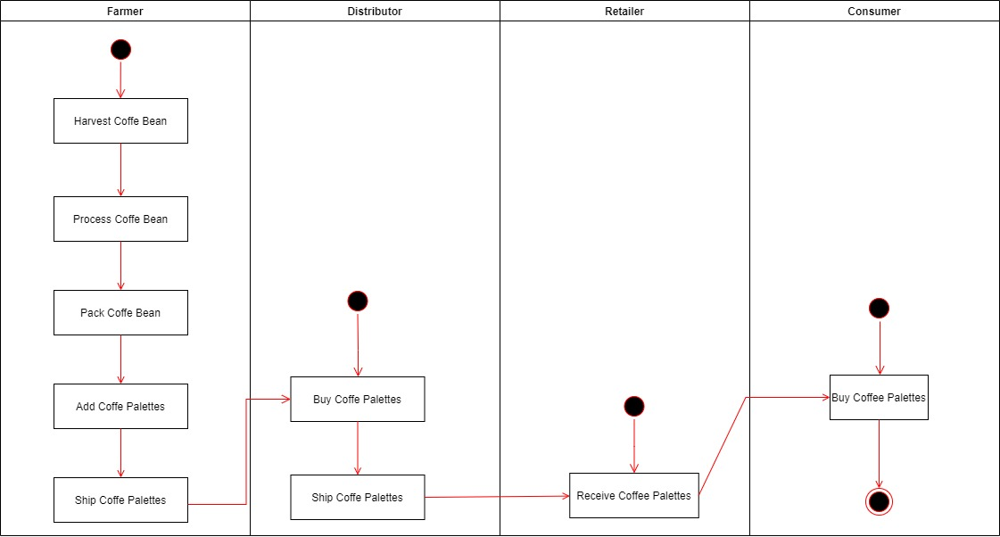
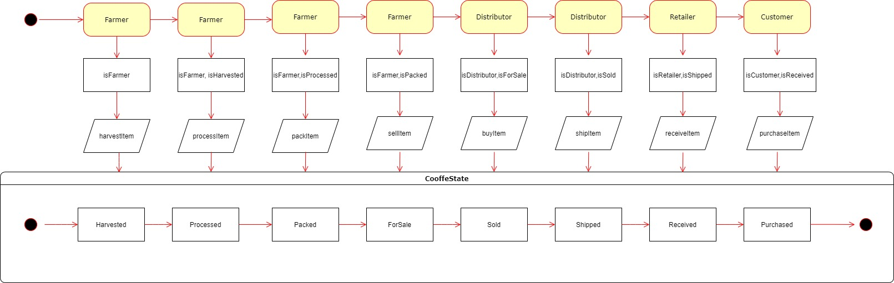
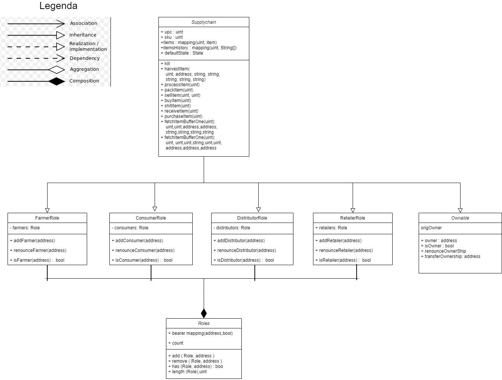

### REQUEST INFORMATION TO SUBMIT PROJECT ###
- Changed truffle.js to truffle-config.js to fix windows terminal problem
  as tiped here https://ethereum.stackexchange.com/questions/21017/truffle-microsoft-jscript-runtime-error

- Followed all tips in the link
  https://andresaaap.medium.com/architect-a-blockchain-supply-chain-solution-part-b-project-faq-udacity-blockchain-da86496fce55
  suggested in peer chat
  
## Part 1: Plan the project with write-ups ##
diagrams path : .\Project3\project-6\diagram in format jpeg or drawio
Activity
- activity_diagram_project3.jpg
- activity_diagram_project3.drawio
  

Sequence (took from Part3 of Project's requirements)
- sequence_diagram_project3.png
 

State
- state_diagram_project3.jpg
- state_diagram_project3.drawio
 

Classes (Data Model)
- class_diagram_project3.jpg
- class_diagram_project3.drawio
 

## Part 2: Project write-up - Libraries ##
npm: 6.13.4

node: 10.18.0

truffle: 4.1.14 - development environment, test and asset

openzeppelin-solidity: ^2.3.0 - library for secure smart contract development

web3: ^1.4.0" - to connect on blockchain

Solidity: v0.4.24 - to compile solidity language

js-yaml: ^4.1.0 - to import YML property file

truffle-hdwallet-provider: ^1.0.17 - to manage connection to wallet from truffle

Infura - deploying smart contract

# Requirement 3: Project write-up - IPFS #
I didn't use IPFS

# Address Smart Contract Supply Chain #
SupplyChain.address : 0x2c2b9c9a4a25e24b174f26114e8926a9f2128fe4

# ---------------------------------------------- #
# ---------------------------------------------- #
# ---------------------------------------------- #

TRUFFLE 

D:\blockchain\UdacityBlockchainDeveloper\Project3\project-6>truffle devel
Truffle Develop started at http://127.0.0.1:9545/

Accounts:
(0) 0x627306090abab3a6e1400e9345bc60c78a8bef57
(1) 0xf17f52151ebef6c7334fad080c5704d77216b732
(2) 0xc5fdf4076b8f3a5357c5e395ab970b5b54098fef
(3) 0x821aea9a577a9b44299b9c15c88cf3087f3b5544
(4) 0x0d1d4e623d10f9fba5db95830f7d3839406c6af2
(5) 0x2932b7a2355d6fecc4b5c0b6bd44cc31df247a2e
(6) 0x2191ef87e392377ec08e7c08eb105ef5448eced5
(7) 0x0f4f2ac550a1b4e2280d04c21cea7ebd822934b5
(8) 0x6330a553fc93768f612722bb8c2ec78ac90b3bbc
(9) 0x5aeda56215b167893e80b4fe645ba6d5bab767de

Private Keys:
(0) c87509a1c067bbde78beb793e6fa76530b6382a4c0241e5e4a9ec0a0f44dc0d3
(1) ae6ae8e5ccbfb04590405997ee2d52d2b330726137b875053c36d94e974d162f
(2) 0dbbe8e4ae425a6d2687f1a7e3ba17bc98c673636790f1b8ad91193c05875ef1
(3) c88b703fb08cbea894b6aeff5a544fb92e78a18e19814cd85da83b71f772aa6c
(4) 388c684f0ba1ef5017716adb5d21a053ea8e90277d0868337519f97bede61418
(5) 659cbb0e2411a44db63778987b1e22153c086a95eb6b18bdf89de078917abc63
(6) 82d052c865f5763aad42add438569276c00d3d88a2d062d36b2bae914d58b8c8
(7) aa3680d5d48a8283413f7a108367c7299ca73f553735860a87b08f39395618b7
(8) 0f62d96d6675f32685bbdb8ac13cda7c23436f63efbb9d07700d8669ff12b7c4
(9) 8d5366123cb560bb606379f90a0bfd4769eecc0557f1b362dcae9012b548b1e5

Mnemonic: candy maple cake sugar pudding cream honey rich smooth crumble sweet treat

⚠️  Important ⚠️  : This mnemonic was created for you by Truffle. It is not secure.
Ensure you do not use it on production blockchains, or else you risk losing funds.

truffle(develop)> compile
truffle(develop)> migrate --reset
Using network 'develop'.

Running migration: 1_initial_migration.js
  Replacing Migrations...
  ... 0x7a364343b2a2910620c86c07ad9fca5b7929a500052f60a56fda09e027844e20
  Migrations: 0x8cdaf0cd259887258bc13a92c0a6da92698644c0
Saving successful migration to network...
  ... 0xd7bc86d31bee32fa3988f1c1eabce403a1b5d570340a3a9cdba53a472ee8c956
Saving artifacts...
Running migration: 2_deploy_contracts.js
  Replacing FarmerRole...
  ... 0xe7c0f6d6453ce54bb1602079478aa93de89048ffdf3bc7407fd2b1adbb2746ab
  FarmerRole: 0x345ca3e014aaf5dca488057592ee47305d9b3e10
  Replacing DistributorRole...
  ... 0x654c48a4ecb01bb012b3b3c06fa1552e43036dd1a147a1c1048514663b855a8c
  DistributorRole: 0xf25186b5081ff5ce73482ad761db0eb0d25abfbf
  Replacing RetailerRole...
  ... 0x09633e572cf04ae057478c1344ab1f41e5b0a8658ffbfe22a4436fb9d0edf6b8
  RetailerRole: 0x8f0483125fcb9aaaefa9209d8e9d7b9c8b9fb90f
  Replacing ConsumerRole...
  ... 0x4e419c4feedb133d465325fd253a65c22e39db7a82909d6528ffe2039f0cda88
  ConsumerRole: 0x9fbda871d559710256a2502a2517b794b482db40
  Replacing SupplyChain...
  ... 0x13f11453d76742ab678c77b6ae287f9fec2cc812090c1cb1647dc56f824d4aef
  SupplyChain: 0x2c2b9c9a4a25e24b174f26114e8926a9f2128fe4
SupplyChain.address : 0x2c2b9c9a4a25e24b174f26114e8926a9f2128fe4
Saving successful migration to network...
  ... 0xc83fc5fb7f26787f1419af3c38d1ca62a79b73bf5fa5c0978d1fb87855a79c27
Saving artifacts...
truffle(develop)> test
Using network 'develop'.

SupplyChain.address : 0xeec918d74c746167564401103096d45bbd494b74
ganache-cli accounts used here...
Contract Owner: accounts[0]  0x627306090abab3a6e1400e9345bc60c78a8bef57
Farmer: accounts[1]  0xf17f52151ebef6c7334fad080c5704d77216b732
Distributor: accounts[2]  0xc5fdf4076b8f3a5357c5e395ab970b5b54098fef
Retailer: accounts[3]  0x821aea9a577a9b44299b9c15c88cf3087f3b5544
Consumer: accounts[4]  0x0d1d4e623d10f9fba5db95830f7d3839406c6af2

  Contract: SupplyChain
contract  address: undefined
    √ Testing smart contract function harvestItem() that allows a farmer to harvest coffee (295ms)
    √ Testing smart contract function processItem() that allows a farmer to process coffee (105ms)
    √ Testing smart contract function packItem() that allows a farmer to pack coffee (117ms)
    √ Testing smart contract function sellItem() that allows a farmer to sell coffee (104ms)
    √ Testing smart contract function buyItem() that allows a distributor to buy coffee (167ms)
    √ Testing smart contract function shipItem() that allows a distributor to ship coffee (127ms)
    √ Testing smart contract function receiveItem() that allows a retailer to mark coffee received (170ms)
    √ Testing smart contract function purchaseItem() that allows a consumer to purchase coffee (167ms)
    √ Testing smart contract function fetchItemBufferOne() that allows anyone to fetch item details from blockchain
    √ Testing smart contract function fetchItemBufferTwo() that allows anyone to fetch item details from blockchain

  10 passing (1s)
