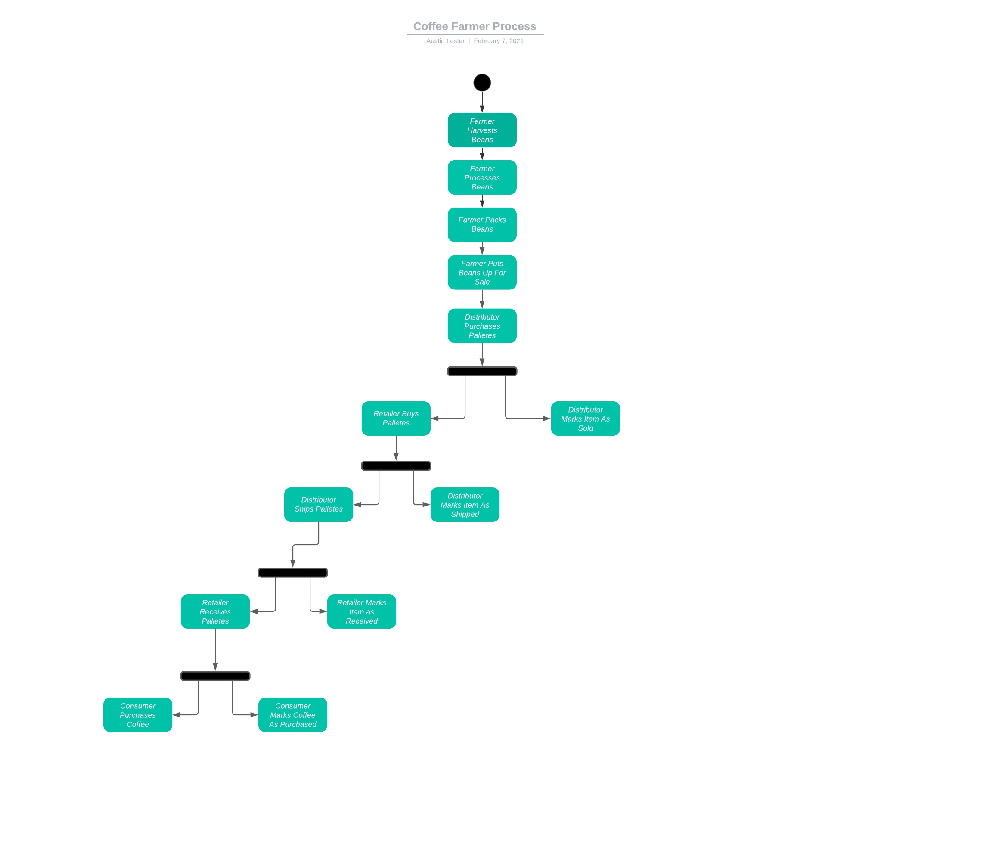
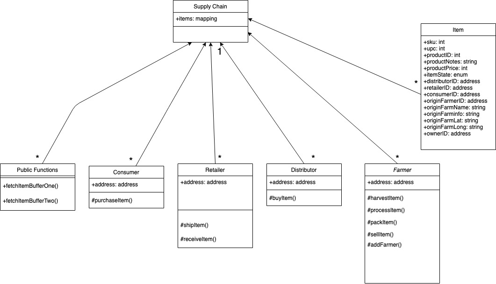
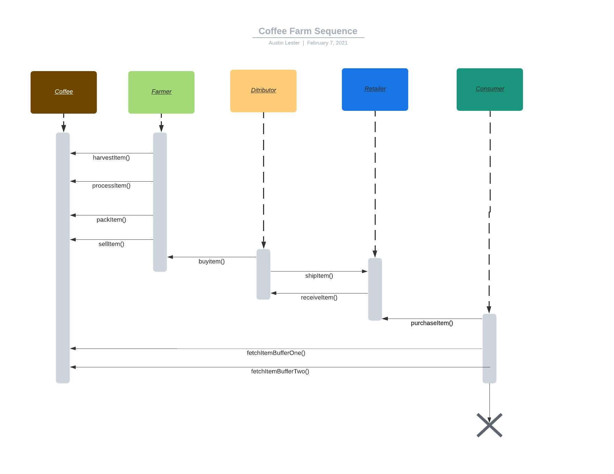
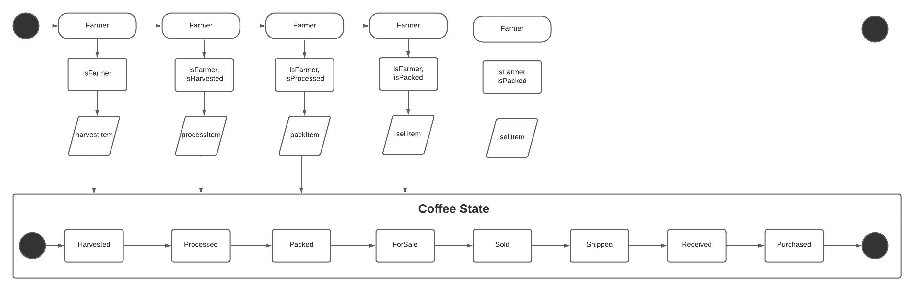

### Description
This supply chain smart contract allows you to track coffee from the field to the retailer. The item is capable of being updated during each step in the process so that you know where it is at and can tell which farm the end product came from. 

### Contract Address

0xe2755C53892f235D21cD975B0a7f3b665488aC05

### Transaction Hash

0x8a1473d03eea40f4df151495468af934179b39c4c442e2dce15960d23b8255c2

### Node Version Number
v10.16.3

### Truffle version number
v5.1.39

### web3 version number
^0.20.7

### Ganache
Project is configured to connect to Ganache at HTTP://127.0.0.1:7545.

### Activity Diagram

### Class Diagram

### Sequence Diagram

### State Diagram

### Libraries
Roles.sol
A roles library was used to manage access to different methods in the smart contract

